# triageq — When Is Imperfect Triage Better Than None?

A Python package implementing the simulation, analytic models, and ML pipeline for the DASA'26 research:

> **"When Is Imperfect Triage Better Than None? Load-Dependent Break-Even Accuracy for ML Triage in Emergency Priority Queues"**

---

## 📊 Figures

### F1 — System Diagram
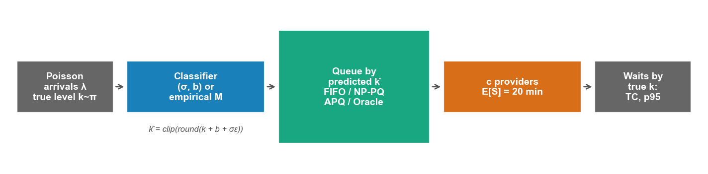

### F2 — Two-Class Break-Even
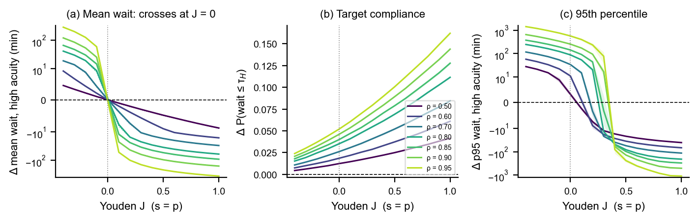

### F3 — Break-Even Curves (p95, c=5, Severe Under-12)
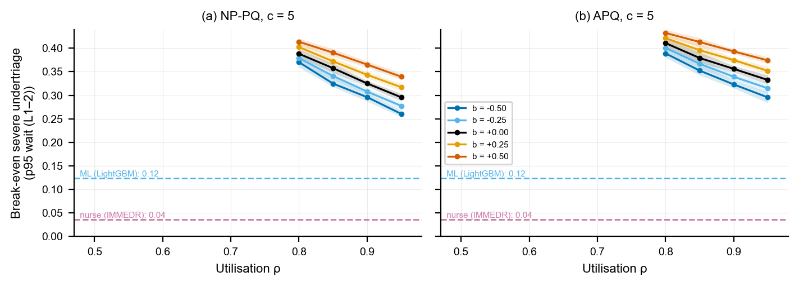

### F4 — TC12 Heatmap (APQ, c=5)
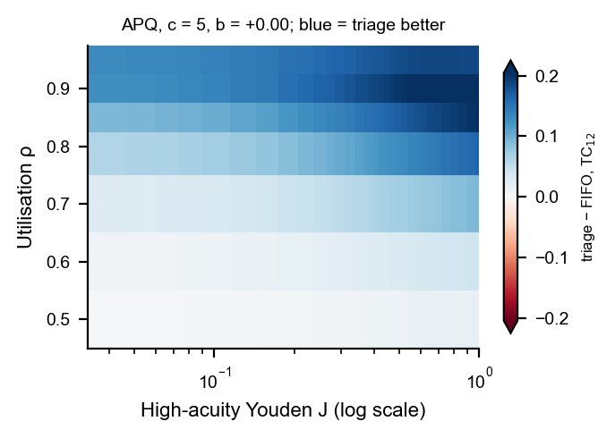

### F5 — Accuracy–Wait Trade-off
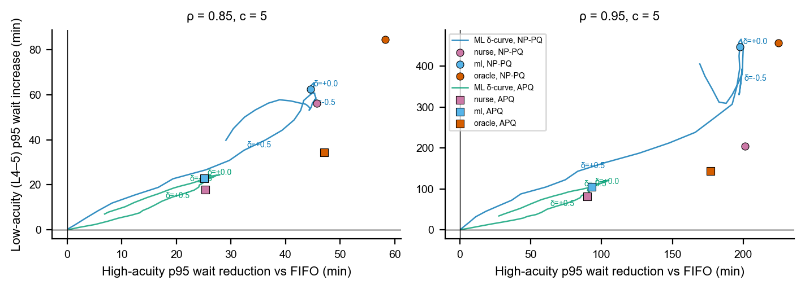

### F6 — Confusion Matrices
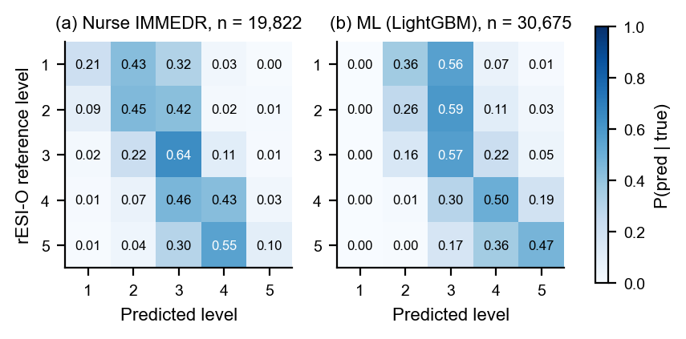

### F7 — Validation Parity
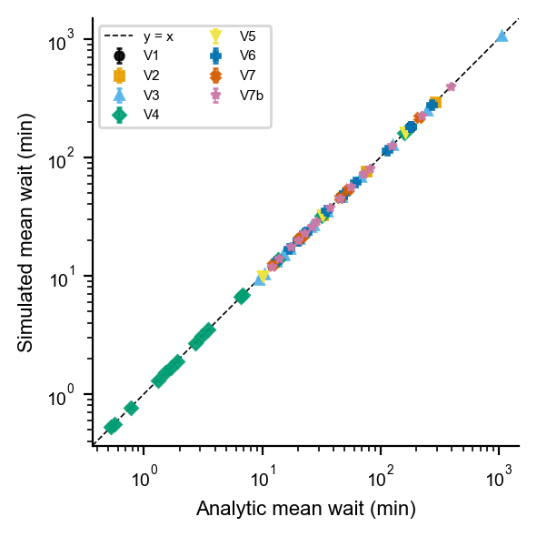

### F8 — Welch Warm-Up
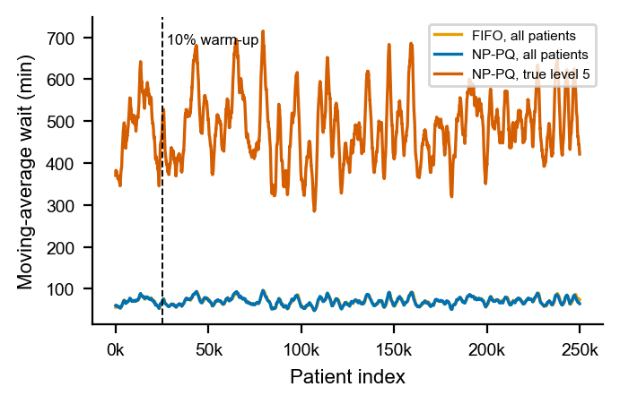

### F9 — ECDF Level 2
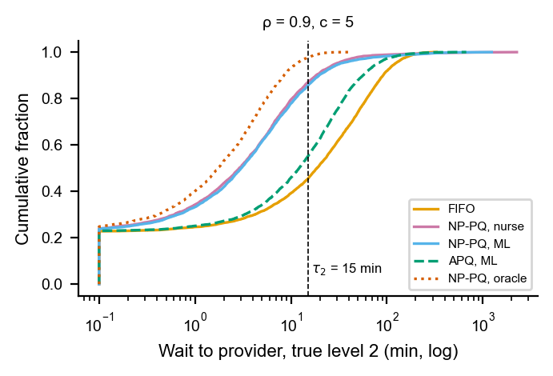

### F10 — Calibration & ROC
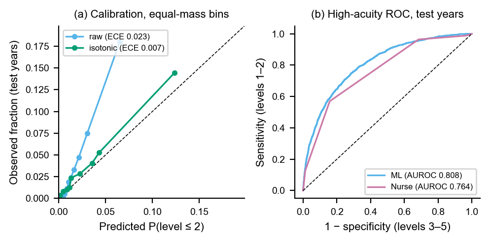

### F11 — Robustness Tornado
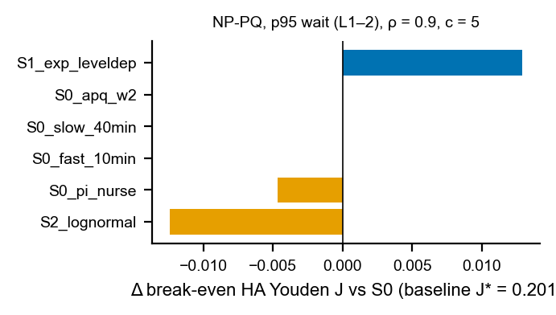

---

## 🗂️ Structure

```
triageq/
  configs/            # YAML experiment configs
  data/raw/           # NHAMCS files (git-ignored)
  data/processed/     # cleaned parquet per year + pooled
  src/triageq/
    errors.py         # ordinal error model, confusion matrices, (σ,b) fitting
    analytic.py       # Cobham, Erlang-C, P-K, Kleinrock APQ, misclassified mean waits
    streams.py        # CRN: pre-drawn arrivals, services, true levels, eps, u
    sim_simpy.py      # reference simulator (FIFO, NP-PQ, APQ, P-PQ, abandonment)
    sim_fast.py       # Numba kernel (FIFO, NP-PQ, APQ; non-preemptive, c servers)
    metrics.py        # per-level waits, TC, percentiles, harm, weighted cost
    breakeven.py      # sign-change search, interpolation, bootstrap CI, conversion
    run.py            # CLI: python -m triageq.run --config configs/e2.yaml
    data/
      nhamcs_load.py  # per-year read + variable-name mapping
      reference.py    # rESI-O and NHAMCS-ESI label construction
      features.py     # triage-time feature matrix, leakage guard
    ml/
      train.py        # LR, LightGBM, ordinal LightGBM; temporal split; tuning
      evaluate.py     # classifier metrics + bootstrap CIs, confusion matrices
      thresholds.py   # delta-shifted cut-points → operating curve
    figures.py        # F1–F11, T1–T6
  tests/
  results/            # parquet per experiment, figures/, tables/
  Makefile
```

---

## 🚀 Quick Start

```bash
# 1. Create virtual environment
python -m venv .venv
# Windows:
.venv\Scripts\activate

# 2. Install dependencies
pip install -r requirements.txt
pip install -e src/

# 3. Run fast tests (< 60 s)
make test

# 4. Run all validation experiments (E0: V1–V8)
make validate

# 5. Run two-class sweep (E1)
make e1

# 6. Run full core sweep (E2, ~3-8 CPU-hours)
make sweep
```

## ⚙️ Key Design Decisions

- **Common Random Numbers (CRN):** All policies share the same pre-drawn arrival times, service times, true levels, and noise ε. This makes break-even curves smooth and paired CIs tight.
- **Two engines:** SimPy for correctness (reference, extensions), Numba for speed (sweeps). `test_kernel_equivalence` (K1) ensures they give identical per-patient waits.
- **Metric of record:** Target compliance (TC₁₂ = P(wait ≤ τₖ) for true levels 1–2), not mean wait. Mean wait is load-independent at break-even (Proposition in Section 5.1); TC is the clinically meaningful metric.
- **Master seed:** `20260925`. All replications derived via `numpy.random.SeedSequence`.

---

## 📚 References

- Argon & Ziya (2009) MSOM: priority under imperfect type identification
- Sun, Argon & Ziya (2022) POMS: when to triage under errors
- Cobham (1954): non-preemptive priority mean waits
- Kleinrock (1964, 1965): conservation law, delay-dependent priority
- Stanford, Taylor & Ziedins (2014): accumulating priority queue for EDs

